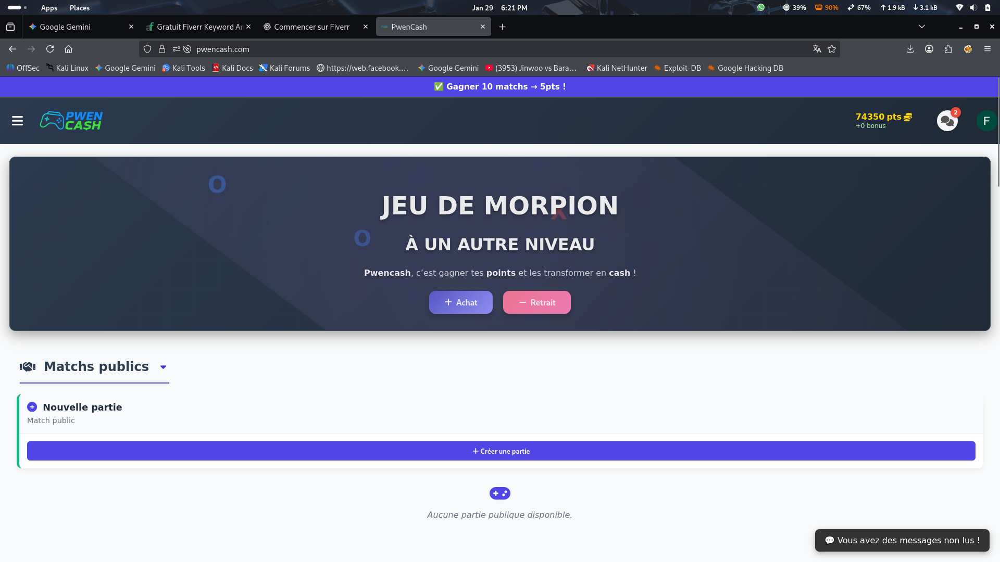

# pwencash

> **Live Demo:** https://pwencash.com/
> **Status:** Production Ready

---

## Pourquoi ce projet est unique ?
Contrairement aux applications classiques, ce projet a été développé avec une approche **Security-First**. Utilisant des méthodologies de tests d'intrusion (Kali Linux environnement), j'ai blindé chaque point d'entrée.

## 🛠 Technologies utilisées
* **Frontend:** React.js / TypeScript / Tailwind CSS
* **Backend:** Node.js / Express
* **Database:** SQL
* **Security:** JWT (JSON Web Tokens), Bcrypt, Helmet.js
* **Environment**: Kali Linux

## Fonctionnalités de Sécurité (Ton point fort)
* **Anti-Injection SQL & NoSQL:** Nettoyage automatique de toutes les entrées utilisateurs.
* **Protection XSS:** Utilisation de headers de sécurité stricts pour empêcher l'exécution de scripts malveillants.
* **Auth Sécurisée:** Système de login avec hachage de mot de passe et expiration de session.

## 📸 Aperçu

